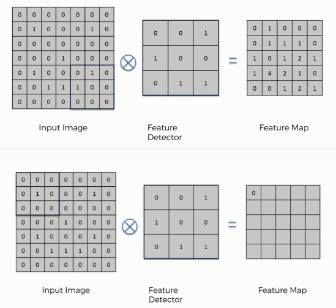
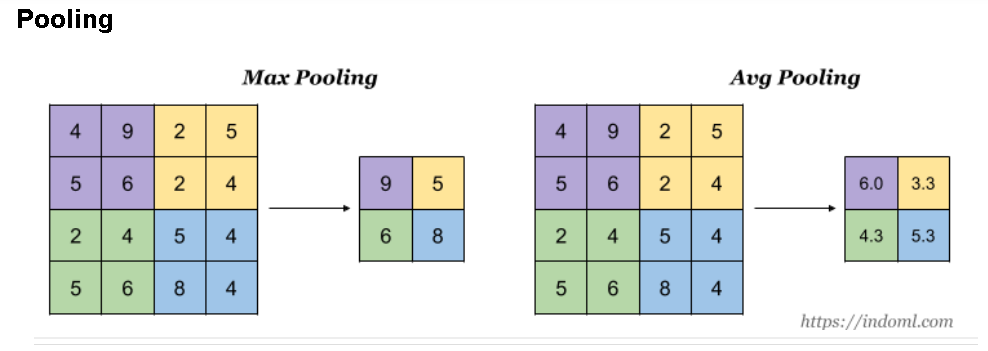
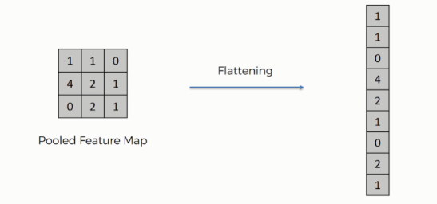
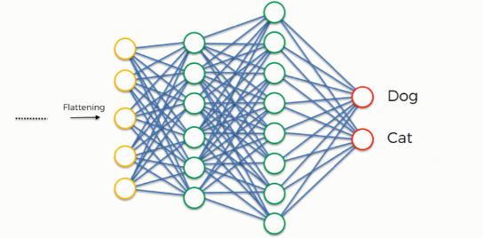

## Understanding Convolutional Neural Networks (CNN or ConvNet)

Ever wondered how does a computer understands whether an image of a dog is actually a dog? Or how does it know whether the nose of the dog is actually a nose? Well it all starts with a **Convolutional Neural Network**.

In this section we would understand the following things in order to understand CNNs:

1. How a computer reads an image?
2. Why don't we use Fully Connected Neural Networks for Image Recognition?
3. What are Convolutional Neural Networks?.
4. How do CNNs work?
5. Use case of CNNs

Let's start...

#### 1. **How a computer reads an image?**

So each image has 3 channels, namely: Red, Green and Blue channels or shortly called as RGB channels. Each of these channels have their respective pixel values which are arranged in rows and columns. So suppose we have an image with specifications as 200x200x3 means that we have 200 rows, 200 columns and 3 channels. This is mainly for colored images, black and white images have only two channels. This is basically how a computer reads an image.

Now, let's move on to our 2nd question...

#### 2. **Why don't we use Fully Connected Neural Networks for Image Recognition?**

Suppose we have an MNIST dataset, which is a dataset of handwritten images of digits,images are only of size 28x28x1 (28 rows, 28 columns, 1 color channel). So a single fully-connected neuron in a first hidden layer of a Fully Connected Neural Network would have 28x28x1 = 786 weights. Also suppose we have 3 color channels i.e. 28x28x3, then too we would have 2352 weights in the first hidden layer. This amount still seems manageable,

*But what if we move to larger images.* For example, an image of more respectable size, e.g. 200x200x3, would lead to neurons that have 200x200x3 = 120,000 weights. We need to deal with such huge amount of parameters, moreover, we would almost certainly would have more number of such neurons. This would eventually lead to **overfitting**. And yes, you guessed it right! This is the main reason why we don't use fully connected neural networks for image classification.

Let's understand what are **Convolutional Neural Networks** and why do we need them.

#### 3. **What are Convolutional Neural Networks?**

Now most of you must be wondering what does the term **Convolution** mean? In purely mathematical terms, convolution is a function derived from two given functions by integration which expresses how the shape of one is modified by the other. Woah! Woah! what was this? To simplify, convolution just means how the shape of one function (be it anything) is modified by the other. That's it! 

But wait, what does it mean in terms of Neural Networks? Well, it is an operation done to extract features from the images which will be further used by the network to learn about a particular image. So, suppose we have an image of a dog. So the feature could be the shape of the nose of the dog or the ears or the eyes etc.

Now, let's move to our main question, **What is CNN?** 

A Convolution Neural Network is a class of Deep Neural Networks applied to classify/analyze images. It is a type of feed forward neural network in which the connectivity pattern between its neurons is inspired by the organization of the animal visual cortex. Visual Cortex is basically a small region of our brain that are sensitive to specific regions of visual field. 

So the basic idea is that, in contrast to the traditional Neural Network, in which each neuron is connected to every other neuron for its input (which is why we call it a Fully Connected Neural Network), in CNN, in each layer,each output value depends only on a small number of inputs. This makes CNN networks easy to train on smaller training datasets and is less prone to overfitting. This phenomenon is also known as **Sparsity of Connections**.

Ok, but how does a CNN work?

#### 4. **How do CNNs work?**

So basically CNNs have 4 layers, namely:

a) Convolution layer b) ReLU layer c) Pooling layer and d) Flattening & Fully Connected Network

#### **A) Convolution Layer:**

Now, in the first layer i.e. the **Convolution layer**, Convolution is performed with the help of three elements:

1. **Input Image-** The image to convolve on.

2. **Feature Detector/Kernel/Filter-** They are the bunch of numbers in a matrix form intended to extract features from an image. They can be 1-dimensional ,2-dimensional or 3-dimensional.

3. **Feature Map/Activation Map-** The resultant of the convolution operation performed between image and feature detector gives a Feature Map.

So how exactly does a convolution operation work?

1. We first project the Feature Detector/Filter onto the Input Image beginning from the top left corner. Suppose we take a 3x3 feature detector. So we project it on the first 3x3 pixels of the input image.
2. Multiply the number in the Feature Detector to that of the Input Image cell wise. We multiply the numbers of the feature detector with that of the first 3x3 pixels of input image cell wise.
3. Sum up all the numbers that you get by multiplying the numbers of the cells and place this number on the first top left corner of the Feature Map.
4. Now move the Feature Detector/Filter to the right and repeat the steps 1 to 3 until you get the Feature Map.

The whole convolution process is as shown below:

Thus, if you have an input image size of, say, 5x5 and feature detector size of 3x3, then the output i.e. feature map will be of size 3x3.

Now, you might be thinking that there is information loss since the input image size does match with that of output feature detector. And yes you are right! The very purpose of the feature detector is to sift through the information in the input image and filter the parts that are integral to it and exclude the rest.

#### **B) ReLU (Rectified Linear Unit) Layer:**

ReLU is function that activates a node only if the input value is above a threshold. If the input value is below zero, the output is zero and if it is above a certain threshold then it has a linear relation with the dependent variable. What this means is that we remove the negative values from the filtered images and replace it with zeros. And why are we doing this? This is done to avoid the summing up the values to zero.

The purpose of applying the rectifier function is to increase the non-linearity in our images. The reason we want to do that is that images are naturally non-linear. Normally an image consists of a lot of non-linear features. But there is chance that we might impose some linearity at the convolution layer. So in order to avoid this we use a rectifier to break up the linearity even further. 

ReLU function looks something like this:

#### **C) Pooling Layer:**

Pooling is of two types: 1) Max Pooling and 2) Average Pooling. The idea behind both these is as shown in the below image:

From the above image we can get a slight understanding that pooling reduces the size of the image. But why exactly do we do pooling? What's in it for us? Well... the following points will make you understand that:

1. To reduce the size of image such that we focus only on the important aspects of the image instead of the image as a whole.
2. To reduce the number of parameters to be computed resulting in greater computation speed.
3. To make some of the features that detects significant things a bit more robust.

The steps involved in pooling is:

1. We first choose a window size of 2 or 3
2. Then we decide how many strides we want, usually its 2
3. Then we project our window on the filtered images and take the maximum value each time.

But wait! Aren't we losing information while doing this? Yes, definitely we are! But the question here is how much information we can afford to lose without impacting  the model prediction. Perhaps the criteria to choose how often (after how many convolutions) and at what part of the network (at the beginning or at the mid or at the end of the network) to use max pooling depends completely on what this network is being used for.

#### **D) Flattening & Fully Connected Network:**

Once we get a pooled feature map of our image, the next step is flattening out the pooled feature map into a column vector like the one shown in the image below:

And why are we doing this? Because we are going to insert this vector into a fully connected neural network to process it further. This vector is given as input to the neural network whose role is to combine a wider variety of attributes and make the CNN more capable to classify images. 

#### **5. Use case of CNN:**

To identify whether the input image is a cat or a dog and similar such use cases.

I hope you have understood on a high level what exactly is a Convolutional Neural Network and how does it work.

### References:

[Youtube video on CNN](https://www.youtube.com/watch?v=umGJ30-15_A)

[CNN Step 1](https://www.superdatascience.com/blogs/convolutional-neural-networks-cnn-step-1-convolution-operation)

[CNN Step 1b](https://www.superdatascience.com/blogs/convolutional-neural-networks-cnn-step-1b-relu-layer/)

[CNN Step 2](https://www.superdatascience.com/blogs/convolutional-neural-networks-cnn-step-2-max-pooling/)

[CNN Step 3](https://www.superdatascience.com/blogs/convolutional-neural-networks-cnn-step-3-flattening/)

[CNN Step 4](https://www.superdatascience.com/blogs/convolutional-neural-networks-cnn-step-4-full-connection)